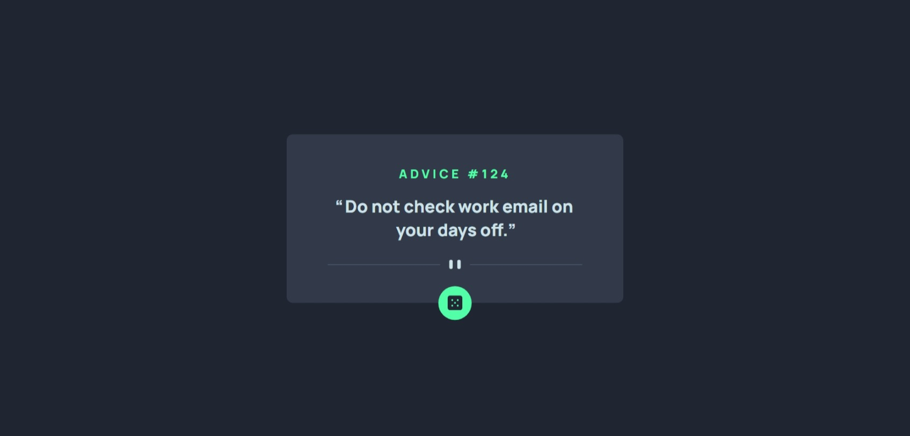

# Frontend Mentor - Advice Generator App Solution

This is a solution to the [Advice Generator App Challenge on Frontend Mentor](https://www.frontendmentor.io/challenges/advice-generator-app-QdUG-13db). Frontend Mentor challenges help you improve your coding skills by building realistic projects.

## Table of contents

-   [Overview](#overview)
    -   [The challenge](#the-challenge)
    -   [Screenshot](#screenshot)
    -   [Links](#links)
-   [My process](#my-process)
    -   [Built with](#built-with)
    -   [What I learned](#what-i-learned)
    -   [Useful resources](#useful-resources)
-   [Author](#author)

## Overview

### The challenge

Users should be able to:

-   View the optimal layout for the app depending on their device's screen size.
-   See hover states for all interactive elements on the page.
-   Generate a new piece of advice by clicking the dice icon.

### Screenshots




### Links

-   Solution URL: [Github Repository](https://github.com/PhilopaterHany/Advice-Generator/)
-   Live Site URL: [Github Pages](https://philopaterhany.github.io/Advice-Generator/)

## My process

### Built with

-   Semantic HTML5 Markup
-   CSS Custom Properties
-   CSS Flexbox
-   Vanilla Javascript
-   Fetch API (ES6)

### What I learned

```js
function showQuote() {
    fetch("https://api.adviceslip.com/advice")
        .then((response) => response.json())
        .then((data) => data.slip)
        .then((data) => {
            adviceId.innerHTML = `ADVICE #${data.id}`;
            adviceText.innerHTML = data.advice;
        })
        .catch((error) => {
            alert(`Error: ${error}`);
        });
}
```

### Useful resources

-   [MDN: Fetch API](https://developer.mozilla.org/en-US/docs/Web/API/Fetch_API/Using_Fetch)

## Author

-   Website - Portfolio Is Coming Out Soon!
-   Frontend Mentor - [@PhilopaterHany](https://www.frontendmentor.io/profile/PhilopaterHany/)
-   Twitter - [@PhilopaterHany4](https://www.twitter.com/PhilopaterHany4/)
-   Facebook - [Philopater Hany](https://www.facebook.com/philopater.hany.3)
-   Discord - [#8178](https://discord.com/#8178/)
